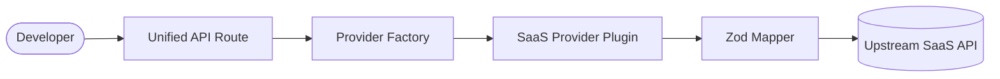

# 🚀 Open IpaaS
**The open-source standard for universal B2B integrations.**

Open IpaaS is a high-performance Node.js (Next.js) framework designed to unify communication with any global SaaS platform (CRMs, ERPs, HRIS, Ticketing, Accounting, e-Commerce, etc.) under a single **English-first**, **strongly-typed**, and **runtime-validated** API.

We believe that enterprise-grade integrations shouldn't be locked behind expensive closed-source paywalls. Open IpaaS gives the community the power to build once and integrate with hundreds of platforms seamlessly.

[Website](https://openipaas.com) | [Documentation](https://openipaas.com/docs) | [Contributing](#contributing)

---

## 💎 Why Open IpaaS?

Integrating with fragmented business APIs is painful. You have to deal with non-standard variables, inconsistent payloads, multiple languages, and missing typing across different software categories. Open IpaaS solves this with:

- 🌍 **English-First Architecture**: Your application communicates entirely in standardized English. The framework handles the translation and normalization of any upstream system (Salesforce, Shopify, QuickBooks, Zendesk, etc.) under the hood.
- 🛡️ **Zod Shield**: Strict runtime validation. If a platform changes its API contract without warning, our shield blocks the inconsistency before it crashes your app.
- 🔌 **Universal Plugin Architecture**: Add new providers in minutes using our automated CLI. No need to touch the core routing logic.
- 📦 **Docker-Native DX**: Spin up the entire environment (Postgres DB + App + Seed data) with a single command.

## 🛠 Architecture



## 🚀 Quick Start

Open IpaaS was built for a flawless Developer Experience (DX).

1. **Clone the repository:**
   ```bash
   git clone https://github.com/felipeperson/openipaas.git
   cd openipaas
   ```

2. **One-Click Launch:**
   ```bash
   docker-compose up --build
   ```
   *This will boot up Postgres, run migrations, and seed the database with test credentials and mock accounts.*

3. **Access the Interactive Docs:**
   Open `http://localhost:3000/docs` to test the unified endpoints immediately.

## ➕ Adding a New Provider

Creating a new provider (e.g., HubSpot, Shopify, Jira, SAP) is automated via our CLI:

```bash
npm run generate-provider hubspot
```
This command instantly generates the provider class, implements the `IUnifiedProvider` interface stubs, and creates the boilerplate for unit tests.

---

## 🤝 Contributing

We want to build the largest open-source catalog of B2B integrations in the world. Whether it is an obscure local accounting system or a global CRM giant, we want it in Open IpaaS.

If you need a specific integration, the best way to get it is by creating a Pull Request following our plugin architecture. Check out our [Contributing Guide](CONTRIBUTING.md) to get started.

## 📄 License

Distributed under the MIT License. See `LICENSE` for more information.
